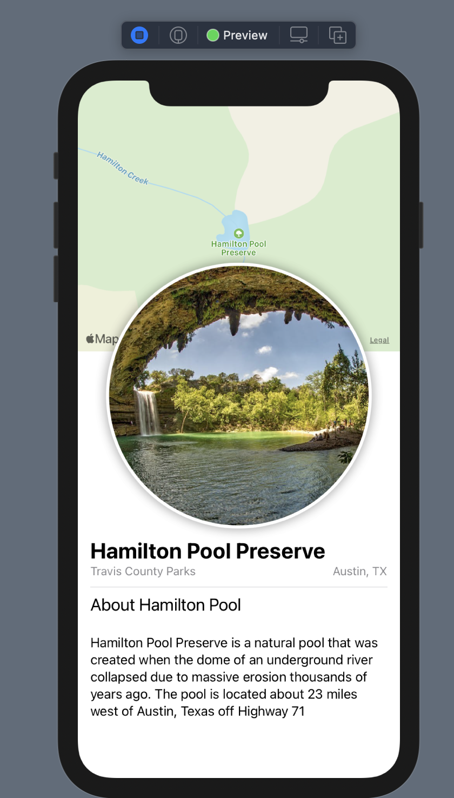

# Landmarks

This is a mobile app that lists and provides landmark/park information. A user can also interact with the map.

## Technologies Used:

- Swift
- SwiftUI
- Xcode
- MapKit
- CoreLocation

## Screenshots:

<!--  -->

